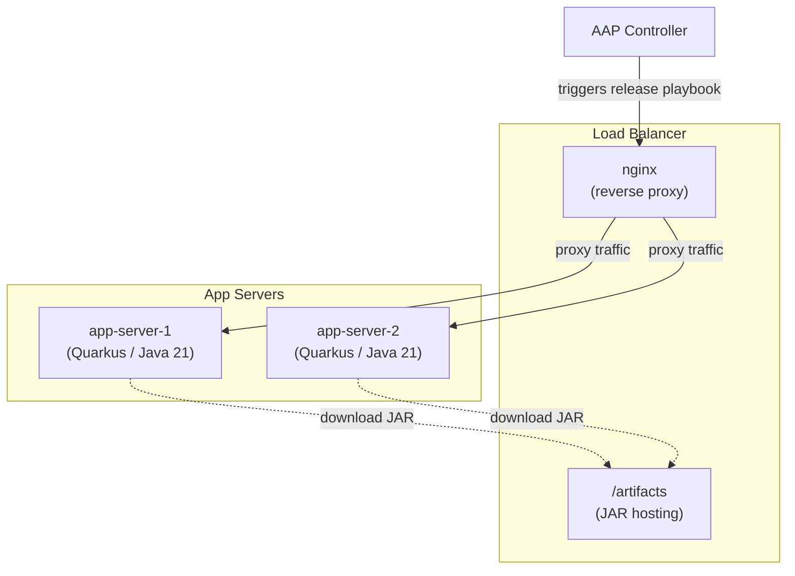
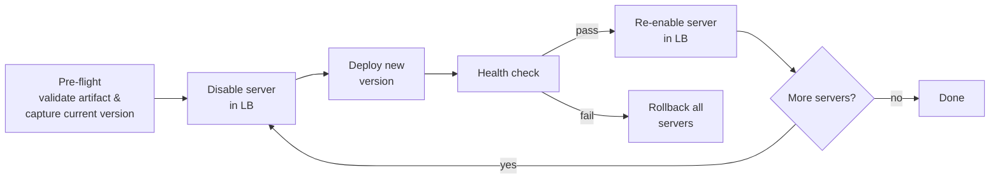

# Ansible Release Engineering Demo

Demonstrates a rolling deployment workflow with automatic rollback using Ansible. A Quarkus Java application is deployed across multiple app servers behind an nginx load balancer, one server at a time. If any server fails during the release, all servers are automatically rolled back to the previous version.

The project also includes Configuration-as-Code (CaC) for provisioning an Ansible Automation Platform (AAP) controller with the organizations, credentials, inventories, projects, and job templates needed to run the workflow.

## Architecture



### Rolling Release Flow



## Components

| Component | Path | Description |
|-----------|------|-------------|
| Sample Application | `app/simple-webapp/` | Quarkus (Red Hat Build) REST application built as an uber-jar with Maven and Java 21. Exposes a version endpoint at `/` and a health endpoint at `/health`. |
| Ansible Playbooks | `ansible/playbooks/` | Four playbooks covering AAP configuration, app server setup, load balancer setup, and the rolling release workflow. |
| Custom Collection | `ansible/collections/.../infra/ansible_release_engineering/` | Three roles (`app_release`, `app_server`, `lb`) that encapsulate deployment, server provisioning, and load balancer management. |
| AAP CaC Config | `ansible/config/aap.yml` | Declarative AAP controller state: organization, credentials, inventory, project, and job template. |
| Inventory | `ansible/inventory.yml` | Three host groups: `aap` (controller), `lb` (1 load balancer), and `app_servers` (2 app servers). |

### Playbooks

| Playbook | Purpose |
|----------|---------|
| `aap_config.yml` | Provisions the AAP controller using CaC definitions from `ansible/config/aap.yml`. |
| `app_server_config.yml` | Initial setup of app servers: installs Java, creates the app user, deploys the JAR, and configures a systemd service. |
| `lb_config.yml` | Configures the nginx load balancer and uploads application artifacts. |
| `app_release.yml` | Performs a rolling deployment with automatic rollback on failure. |

### Collection Roles

| Role | Purpose |
|------|---------|
| `app_release` | Validates artifact availability, captures the current deployed version for rollback, and handles the deploy-restart-healthcheck cycle. |
| `app_server` | Provisions app servers with Java 21, a dedicated app user, systemd service, and firewall rules. |
| `lb` | Installs and configures nginx as a reverse proxy, manages the upstream server list, and serves build artifacts from `/artifacts`. |

## Setup

The following steps walk through setting up the demo in your own environment. You will need three RHEL servers (one load balancer and two app servers), an AAP controller instance, and SSH access to all hosts.

### Prerequisites

- Java 21 and Maven installed on the build machine
- Ansible installed with the required collections (`ansible-galaxy collection install -r ansible/requirements.yml`)
- SSH key-based access to all target hosts

### 1. Build the Application

Build the Quarkus application and produce JARs for two versions so the release workflow can be demonstrated.

```bash
pushd app/simple-webapp

# Build version 1.0.0-SNAPSHOT
mvn clean package -s settings.xml -DskipTests

# Copy the runner JAR to a staging directory
mkdir -p /tmp/artifacts
cp target/simple-webapp-1.0.0-SNAPSHOT-runner.jar /tmp/artifacts/

# Update the version to 1.0.1-SNAPSHOT
sed -i 's/1.0.0-SNAPSHOT/1.0.1-SNAPSHOT/' pom.xml

# Build version 1.0.1-SNAPSHOT
mvn clean package -s settings.xml -DskipTests
cp target/simple-webapp-1.0.1-SNAPSHOT-runner.jar /tmp/artifacts/

popd
```

### 2. Update the Inventory

Edit `ansible/inventory.yml` and replace the placeholder values with the details of your environment:

- **`aap`** group: set `aap_hostname`, `aap_username`, and `aap_password` for your AAP controller instance.
- **`lb`** group: set `ansible_host` for `lb-1` to the IP address or hostname of your load balancer server.
- **`app_servers`** group: set `ansible_host` for `app-server-1` and `app-server-2` to the IP addresses or hostnames of your app servers.

### 3. Configure the Load Balancer

Run the `lb_config.yml` playbook, passing the path to the directory containing the JARs built in step 1:

```bash
ansible-playbook -i ansible/inventory.yml ansible/playbooks/lb_config.yml \
  -e lb_artifact_files="simple-webapp-1.0.0-SNAPSHOT-runner.jar,simple-webapp-1.0.1-SNAPSHOT-runner.jar"
```

This installs nginx, configures it as a reverse proxy to the app servers, and uploads the application JARs to the `/artifacts` directory on the load balancer.

### 4. Configure the App Servers

Run the `app_server_config.yml` playbook to provision the app servers with Java, a dedicated app user, the initial application JAR, and a systemd service:

```bash
ansible-playbook -i ansible/inventory.yml ansible/playbooks/app_server_config.yml
```

### 5. Configure AAP (Configuration-as-Code)

Edit `ansible/config/aap.yml` and update the following values:

- **`controller_hosts`**: set the `ansible_host` variable for `lb-1`, `app-server-1`, and `app-server-2` to their IP addresses or hostnames.
- **`controller_projects`**: update `scm_url` if using a fork of this repository.

### 6. Provision the AAP Controller

Run the `aap_config.yml` playbook, providing the path to the SSH private key used to connect to the managed hosts:

```bash
ansible-playbook -i ansible/inventory.yml ansible/playbooks/aap_config.yml \
  -e "cac_ssh_private_key_file=/path/to/private/key"
```

This creates the organization, credentials, inventory, project, and job template on the AAP controller. Once complete, you can trigger the **Release Application** job template from the AAP UI, providing a version (e.g., `1.0.1-SNAPSHOT`) to perform a rolling deployment.

### 7. View the Application

Now that all of the steps have been completed to prepare the environment, navigate to the hostname of the Load Balancer instance in a browser. The web application should be displayed along with its corresponding version.

### 8. Trigger a Release from AAP

A new release of the application can be triggered using your AAP instance now that it has been populated with the necessary resources.

Navigate to the AAP instance in a browser and select **Automation Execution** -> **Templates**. Select **Release Application** and the click **Launch Template**.

Enter the version of the application that you would like to update to: `1.0.1-SNAPSHOT` (simulates `1.0.0-SNAPSHOT` -> `1.0.1-SNAPSHOT`). Click **Next** and then **Finish** to start the release process.

Once the automation completes successfully, navigate back to the hostname of the Load Balancer instance in a browser and confirm the application has been updated to the specified version.
